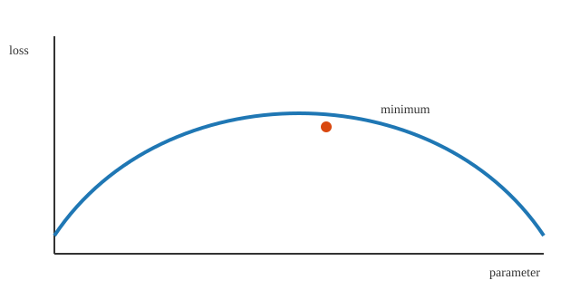
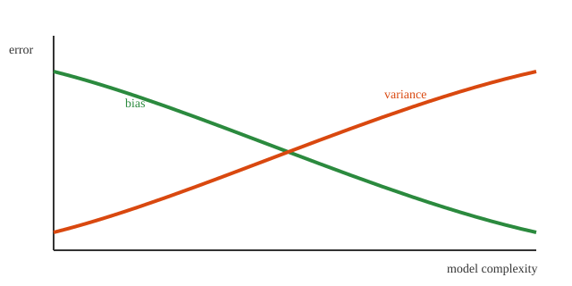

---
title: "Interactive ML plots"
date: 2026-01-25
draft: false
math: false
toc: true
---

This post is a self-contained demo of interactive ML visuals built with plain HTML, SVG, and JavaScript (no external libraries). It uses simple sliders and buttons to change the plots in real time.

## Interactive 1: Polynomial regression (degree slider)

  

    <label>
      Degree
      <input type="range" min="1" max="7" value="3" step="1" data-role="degree" />
      3
    </label>
    <label>
      Show true function
      <input type="checkbox" checked data-role="show-true" />
    </label>
    <button type="button" class="ml-button" data-role="regen">Regenerate noise</button>
    MSE: 0.000
  

  <svg class="ml-plot" viewBox="0 0 640 360" role="img" aria-label="Polynomial regression fit">
    <rect x="0" y="0" width="640" height="360" fill="white"></rect>
    <g data-role="grid"></g>
    <g data-role="points"></g>
    <path data-role="true" fill="none" stroke="#2b8a3e" stroke-width="2" opacity="0.8"></path>
    <path data-role="fit" fill="none" stroke="#1f77b4" stroke-width="3"></path>
    <g data-role="axes"></g>
  </svg>
  

    fit
    true
    data
  

## Interactive 2: Logistic curve (steepness + threshold)

  

    <label>
      Steepness k
      <input type="range" min="0.5" max="8" value="2" step="0.1" data-role="k" />
      2.0
    </label>
    <label>
      Threshold
      <input type="range" min="0.1" max="0.9" value="0.5" step="0.05" data-role="thresh" />
      0.50
    </label>
  

  <svg class="ml-plot" viewBox="0 0 640 360" role="img" aria-label="Logistic curve">
    <rect x="0" y="0" width="640" height="360" fill="white"></rect>
    <g data-role="grid"></g>
    <line data-role="thresh-line" x1="0" y1="0" x2="0" y2="0" stroke="#d9480f" stroke-width="2" stroke-dasharray="6 6"></line>
    <path data-role="curve" fill="none" stroke="#1f77b4" stroke-width="3"></path>
    <g data-role="samples"></g>
    <g data-role="axes"></g>
  </svg>
  

    sigmoid
    threshold
  

